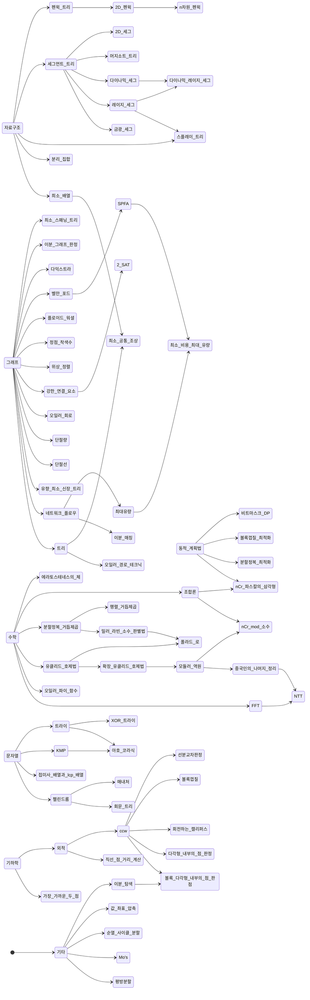

   
<!-- ### 코드 작성
변수명 통일 -> [참고](/C++%20관련%20정보들/기타/Variable%20Name.md)   
vector쓸 땐 array doubling 고려   
매개변수로 vector나 string 받을 땐 가능하면 최대한 상수 참조 사용   

### 카테고리 작성
css로 티어색깔 표시. \ 사용   
알고리즘의 난이도는 1\~3은 +, 4\~5는 -로 표시   
백준에 단일 태그로 존재하는 주요 알고리즘이나 유명한 트릭이 아닌, 지엽적이거나 추가적인 구현체는 _이텔릭체_ 로 표시   
별로 중요하지 않거나 구현계획 없는 알고리즘은 ~~취소선~~으로 표시

### 문서 작성
VSC markdown.json에서 문서 작성용 템플릿 스니펫 사용   
__주의사항__ 에 코드 작성하면서 겪었던 런타임 에러나 오류들 기록   
코드를 사용할 때의 주의사항이 아니라 해당 코드 구현하면서 겪은 주의사항을 기록   
__시간복잡도__ 는 LaTeX 수식 사용. log(N)은 괄호 없이 logN으로 표기   
__사용관련__ 은 코드 사용할 때 참고할 내용 기록   
__백준문제__ 에는 혹시 코드 수정하게 됐을 때 테스트해볼 수 있도록 문제 링크 적어두기   

### 그래프 작성
카테고리에 있는 알고리즘 중 문서 작성 완료된 것들만 그래프에 포함   
mermaid stateDiagram-v2 사용   

## -->
# time complexity
| constraints           | time complexity                           | algorithm                                             |
|-----------------------|-------------------------------------------|-------------------------------------------------------|
| $n \le 12$            | $O(n!)$                                   |                                                       |
| $n \le 25$            | $O(2^n)$, $O(n^2 \cdot 2^n)$              |                                                       |
| $n \le 50$            | $O(\sqrt2^n)$                             |                                                       |
| $n \le 100$           | $O(n^4)$                                  |                                                       |
| $n \le 500$           | $O(n^3)$                                  |                                                       |
| $n \le 5,000$         | $O(n^2)$                                  |                                                       |
| $n \le 100,000$       | $O(n \sqrt n)$, $O(n \log^2n)$            |                                                       |
| $n \le 1,000,000$     | $O(n \log n)$                             |                                                       |
| $n \le 5,000,000$     | $O(n \log n)$                             | SegmentTree(bottom-up only)                           |
| $n \le 100,000,000$   | $O(n)$                                    |                                                       |
| $n \gt 10^8 $         | $O(logn)$, $O(1)$                         |                                                       |

# ps algorithm
티어 분류 :
실버(S)
골드(G)
플레(P)
다이아(D)
루비(R)
기타(A)

* ### 자료구조
  * #### 세그먼트 트리
    * [펜윅 트리(G+)](/자료구조/세그먼트%20트리/펜윅.md)
    * [세그먼트 트리(G+)](/자료구조/세그먼트%20트리/세그.md)
    * [비재귀 세그(G+)](/자료구조/세그먼트%20트리/비재귀%20세그.md)
    * [세그 이분 탐색(P-)](/자료구조/세그먼트%20트리/세그%20이분%20탐색.md)
    * [2D 펜윅(P-)](/자료구조/세그먼트%20트리/2차원%20펜윅.md)
    * [2D 세그(P-)](/자료구조/세그먼트%20트리/2차원%20세그.md)
    * [n차원 펜윅(P-)](/자료구조/세그먼트%20트리/다차원%20펜윅.md)
    * [머지소트 트리(P-)](/자료구조/세그먼트%20트리/머지소트%20트리.md)
    * [레이지 세그(P-)](/자료구조/세그먼트%20트리/레이지%20세그.md)
    * [비재귀 레이지 세그] <!-- https://www.acmicpc.net/blog/view/117 -->
    * [다이나믹 세그, 다이나믹 레이지 세그(P-)](/자료구조/세그먼트%20트리/다이나믹%20세그.md)
    * ~~[_range GCD 세그(P+)_](/자료구조/세그먼트%20트리/GCD%20세그.md)~~
    * [금광 세그(P+)](/자료구조/세그먼트%20트리/금광%20세그.md)
    * [퍼시스턴트 세그(P+)]
    * [세그트리 비츠(D+)]
  * #### BBST
    * [스플레이 트리(D-)](/자료구조/BBST/SplayTree.md)
    * [링크/컷 트리(D+)]
    * [레드-블랙 트리]
  * #### 기타
    * [분리 집합(G-)](/자료구조/기타/Disjoint%20Set.md)
    * [유니온 파인드 롤백]
    * [희소 배열(G+)](/자료구조/기타/희소배열.md)
    * [XOR 트라이(P-)](/자료구조/기타/XOR%20Trie.md)
    * [로프]
    * [데카르트 트리]
    * [Line container]
    * [리-차오 트리(D-)]
    <!-- * [weighted QU] -->
    <!-- * [B-tree]
    * [SPQR tree]
    * [treap]
    * [wavelet 트리(P+)] -->
* ### 그래프 이론
  * #### 그래프
    <!-- https://ps.mjstudio.net/tip-bfs-fill -->
    <!-- * [온라인 동적 연결성 판정] -->
    * [flood fill]
    * [0-1 bfs(G-)]
    * [이분 그래프 판정(G-)](/그래프%20이론/그래프/이분그래프%20판정.md)
    * [다익스트라(G-)](/그래프%20이론/그래프/Dijkstra.md)
    * ~~[A*]~~
    * [벨만-포드(G-)](/그래프%20이론/그래프/Bellman-Ford.md)
    * [SPFA(G-)](/그래프%20이론/그래프/SPFA.md)
    * [플로이드 워셜(G-)](/그래프%20이론/그래프/Floyd-Warshall.md)
    * [최소 스패닝 트리: Kruskal(G-)](/그래프%20이론/그래프/MST.md)
    * ~~[최소 스패닝 트리: Prim(G-)]~~
    * [최소 스패닝 트리: Borůvka]
    * [_정점 착색수(G+)_](/그래프%20이론/그래프/Graph%20Coloring.md)
    * [_간선 착색수_]
    * [위상 정렬(G+)](/그래프%20이론/그래프/Topological%20Sort.md)
    * [kth 최단 경로]
    * [강한 연결 요소(P-)](/그래프%20이론/그래프/SCC.md)
    * [2-SAT(P-)](/그래프%20이론/그래프/2-SAT.md)
    * [오일러 회로(P-)](/그래프%20이론/그래프/오일러%20회로.md)
    * [단절점(P-)](/그래프%20이론/그래프/단절점.md)
    * [단절선(P-)](/그래프%20이론/그래프/단절선.md)
    * [이중 연결 요소]
    * [블록 컷 트리]
    * [선인장]
    * [_2th MST(D-)_]
    * [쌍대 그래프(D-)]
    * [도미네이터 트리(D-)]
    * [오프라인 동적 연결성 판정]
    * [유향 MST(D+)](/그래프%20이론/그래프/DMST.md)
    * [현 그래프(D+)]
    * [일반 매칭(D+)]
    * [offline incremental SCC(R-)](/그래프%20이론/그래프/Offline%20Incremental%20SCC.md)
    <!-- * [현 그래프 판정] -->
    <!-- * [Perfect Elimination Ordering] -->
    <!-- * [_최소 차수 MST_] -->
  * #### [네트워크 플로우](/그래프%20이론/네트워크%20플로우/개념%20정리.md)
    * [최대유량: Edmonds-Karp (P-)](/그래프%20이론/네트워크%20플로우/최대%20유량.md)
    * [최대유량: Dinic (P-)]
    * ~~[최대유량: Push-Relabel (P-)]~~
    * [최소 비용 최대 유량(P+)](/그래프%20이론/네트워크%20플로우/MCMF.md)
    * [이분 매칭(P-)](/그래프%20이론/네트워크%20플로우/이분매칭.md)
    * [Circulation] <!-- https://blog.naver.com/kks227/221426339344 -->
    * [이분 매칭: Hopcraft-Karp]
    * [Stoer-Wagner Algorithm]
    * [Gomory-Hu Tree]
    * [헝가리안]
    * [L-R flow]
  * #### 트리
    * [최소 공통 조상(P-)](/그래프%20이론/트리/LCA.md)
    * [LCA를 통한 트리 쿼리(P-)](/그래프%20이론/트리/Query%20with%20LCA.md)
    * [오일러 경로 테크닉(P-)](/그래프%20이론/트리/ETT.md)
    * [heavy-light 분할(P+)]
    * [트리 압축]
    * [센트로이드 분할(D-)]
    * [트리 동형 사상]
    * [탑 트리(R-)]
* ### [DP](/DP/Top-Down%20DP.md)
  <!-- * [배낭 문제(G-)] -->
  <!-- 비트셋 배낭 https://www.acmicpc.net/problem/16072 -->
  <!-- * [비트셋 LCS] -->
  <!-- * [비트 집합] -->
  * [Kadane algorithm(S+)](/DP/Kadane%20Algorithm.md)
  * [LCS(G-)](/DP/lcs.md)
  * [배낭 문제(G-)](/DP/Knapsack.md)
  * [비트셋 배낭(G-)](/DP/Knapsack(Bitset).md) <!-- https://egod1537.tistory.com/entry/Bounded-Knapsack-Problem%ED%9A%A8%EC%9C%A8%EC%A0%81%EC%9C%BC%EB%A1%9C-%ED%95%B4%EA%B2%B0%ED%95%98%EA%B8%B0 -->
  * [비트마스크 DP(G+)](/DP/Bitmask%20DP.md)
  * [최단거리 역추적]
  * [SOS DP(D-)](/DP/SOS%20DP.md)
  * [히르쉬버그(D+)]
  * [Connection Profile DP]
  * [토글링]
  * [볼록껍질 최적화(P+)](/DP/CHT.md)
  * [분할정복 최적화(P+)](/DP/DnC.md)
  * [크누스 최적화]
  * [단조큐 최적화]
  * [Slope trick(D-)]
  * [키타마사(D-)]
  * [벌레캠프-매시(D+)]
  <!-- * [aliens 트릭(D-)] -->
* ### 문자열
<!-- RBS(Regular Bracket Sequence) -->
  * [트라이(G+)](/문자열/Trie.md)
  * [매내처(P-)](/문자열/Manacher.md)
  * [KMP(P-)](/문자열/KMP.md)
  * [아호 코라식(P+)](/문자열/Aho-Corasick.md)
  * ~~[bitap algorithm]~~
  * [해싱]
  * [라빈 카프]
  * [접미사 배열과 lcp 배열(P+)](/문자열/Suffix%20and%20LCP%20Array.md)
  * [Z algorithm]
  * [회문 트리(D+)](/문자열/회문%20트리.md)
  * [접미사 트리(R-)]
* ### 기하학
  <!-- * ~~[반공간 교집합]~~ -->
  * [cross product, CCW, 직선-점 거리 계산(G-)](/기하학/Geometry%20Header.md)
  * [plane sweeping]
  * [볼록다각형 넓이(G-)](/기하학/Polygon%20Area.md)
  * [볼록다각형 판정]
  * [선분교차판정(G+)](/기하학/선분교차판정.md)
  * [선분교차점 계산(P-)](/기하학/Intersection%20Calculate(LL).md)
  * [볼록 껍질(P-)](/기하학/볼록%20껍질.md)
  * [가장 먼 두 점 : 회전하는 캘리퍼스(P-)](/기하학/Rotating%20Calipers.md)
  * [다각형 내부의 점 판정(P-)](/기하학/PIP.md)
  * [볼록 다각형 내부의 점 판정(P+)](/기하학/PIP(convex).md)
  * [등적등주 분할(P+)](/기하학/Equalizer.md)
  * [가장 가까운 두 점(P+)](/기하학/Closest%20Two%20Points.md)
  * [최소 외접원(P+)]
  * [볼록다각형 접선]
  * [불도저]
  * [반평면 교집합(D-)]
  * [KD tree]
  * [그린 정리(D+)]
  * [델로네 삼각분할(R-)]
  * [보로노이 다이어그램(R-)]
* ### [수학](/수학/개념%20정리.md)
  <!-- * [고합성수 찾기]
  * [우월고합성수] -->
  <!-- * [Linear-sieve] -->
  * [에라토스테네스의 체(S+)](/수학/에라토스테네스의%20체.md)
  * [분할정복 거듭제곱(S+)](/수학/빠른%20거듭제곱.md)
  * [nCr, 파스칼의 삼각형(S+)](/수학/Combination(DP).md)
  * [p-지수(G+)](/수학/p-지수.md)
  * [확장 유클리드 호제법, 모듈러 역원(G+)](/수학/ExtendedGCD,%20Modular%20Inverse.md)
  * [오일러 파이 함수(G+)](/수학/Phi%20Function.md)
  * [중국인의 나머지 정리(P-)](/수학/CRT.md)
  * [Garner's algorithm]
  * [nCr mod 소수, 뤼카(P-)]
  * [nCr mod 합성수(D-)]
  * [밀러-라빈 소수 판별법(P+)](/수학/MillerRabin.md)
  * [폴라드 로(P+)](/수학/PollardRho.md)
  * [이산 로그(P+)]
  * [FFT(P+)](/수학/FFT.md)
  * ~~[카라츠바]~~
  * [3진 FFT(D-)]
  * [NTT(D-)](/수학/NTT.md)
  * [FFT 나눗셈]
  * [FFT 응용] <!-- https://hyperbolic.tistory.com/4 -->
  * [online FFT]
  * [포함 배제의 원리, 뫼비우스 함수, 뫼비우스 반전(D-)]
  * [생성 함수(D-)]
  * [Tonelli-Shanks algorithm(D-)](/수학/Tonelli-Shanks.md)
  * [Cornacchia's algorithm(D-)](/수학/Cornacchia.md)
  * [이산 제곱근]
  * [메르텐스 함수]
  * [매트로이드(R-)]
* ### 선형대수학
  * [행렬(S-)](/선형대수학/Matrix.md)
  * [가우스 소거법(P-)]
  * [키르히호프(P-)] <!-- https://www.acmicpc.net/problem/9614 -->
* ### 게임 이론
  * [스프라그-그런디] <!-- (비트셋) -->
  * [hackenbush]
* ### 기타
  * [비트 트릭(A)](/기타/Bit%20Trick.md)
  * [계수 정렬]
  * [기수 정렬(S-)](/기타/Radix%20Sort.md)
  * [이분탐색(S-)](/기타/이분탐색.md)
  * [투 포인터(S-)](/기타/Two%20Pointer.md)
  * [비트마스크(S-)](/기타/Bitmask.md)
  * [좌표 압축(S-)](/기타/좌표압축.md)
  * [순열 사이클 분할(S+)](/기타/순열%20사이클%20분할.md)
  * [모노톤 스택]
  * [모노톤 큐]
  * [누적합, imos]
  * [후위 표기식(G+)](/기타/Postfix%20Notation.md)
  * [중간에서 만나기(G+)]
  * [반전수(P-)](/기타/반전수.md)
  * [스위핑]
  * [슬라이딩 윈도우]
  * [덱을 이용한 구간 최댓값 트릭(P-)](/기타/Deque%20Trick.md)
  * [삼분 탐색(P-)](/기타/삼분탐색.md)
  * [Mo's algorithm(P+)](/기타/Mo's.md)
  * [평방분할(P+)](/기타/제곱근%20분할법.md)
  * [병렬 이분 탐색(P+)]
  * [춤추는 링크, 크누스 X]
  * [임의 정밀도(epsilon값 계산)(A)]
  * ~~[담금질 기법]~~
* ### utils
  * [fastio] <!-- https://www.acmicpc.net/blog/view/105 -->
  * [문자열 압축](/utils/String%20Compression.md)
  * [개수 계산](/utils/Counter.md)
  * [랜덤](/utils/Random.md)
  * [고합성수 검색](/utils/Highly%20Composite%20Number.md)
  * [배열 연산](/utils/Array.md)
  * [가까운 2의 멱수 계산](/utils/Nearest%20Power2.md)
  * [bigInt]()
  * [baseInt]() <!-- bigint랑 합쳐서 구현하는 게 나을 듯 -->
# C++ 유용한 기능
* ### 문법
  * [range-based for loop]
  * [using] <!-- 기하학 풀 때 using ld; -->
  * [literal]
  * [template argument deduction](/C++/문법/Template%20Argument%20Deduction.md)
  * [람다 재귀]
  * [코드 여러줄 이어쓰기]
  * [리터럴 여러줄 이어쓰기]
* ### 함수
  * [수학관련] <!-- atan, atan2 추가하기 -->
  * [배열관련] <!-- copy doubling -->
  * [타입관련](/C++/함수/casting%20operators.md)
  * [GCC built-in](/C++/함수/builtin.md)
  * [문자관련](/C++/함수/char.md)
  * [문자열관련](/C++/함수/string.md)
  * [이분탐색 람다함수](/C++/함수/lower_bound_lambda.md)
  * [permutation]
  * [custom pq](/C++/함수/costom%20pq.md)
  * [io manip]
  * [ext](/C++/함수/ext.md)
* ### ps용 환경설정
  * [cph]
  * [snippet](/C++/ps용%20환경설정/snippet.md)
  * [debug, c_cpp_properties.json 설정]
  <!-- * Pre-defined Compiler Macros
  * 버전 gnu++17로 해야 Template argument deduction 등 문법 사용가능 -->
  * [predifined macro]
  * [percompiled header] <!-- https://codeforces.com/blog/entry/79026 --> <!-- https://codeforces.com/blog/entry/53909? -->
* ### 기타
  * [자주 쓰는 변수명](/C++/기타/Variable%20Name.md)
  * [코딩 아이디어](/C++/기타/Idea.md)
  <!-- https://xy-plane.tistory.com/11 -->
# 참고문헌
tlsdydaud1   
https://00ad-8e71-00ff-055d.tistory.com/3   

jh05013   
https://jh05013.github.io/%EC%95%8C%EA%B3%A0%EB%A6%AC%EC%A6%98/   

jhnah917   
https://justicehui.github.io/tutorial/   
https://github.com/justiceHui/Unknown-To-Wellknown   

jin814   
https://blog.naver.com/jinhan814/222439886998   
https://blog.naver.com/PostView.naver?blogId=jinhan814&logNo=222689836982&parentCategoryNo=&categoryNo=6&viewDate=&isShowPopularPosts=false&from=postView   

kcm1700   
https://algospot.com/wiki/read/%EC%95%8C%EA%B3%A0%EB%A6%AC%EC%A6%98_%EB%8C%80%ED%9A%8C%EC%97%90_%ED%95%84%EC%9A%94%ED%95%9C_%EC%88%98%ED%95%99   

https://algospot.com/wiki/read/%EC%95%8C%EA%B3%A0%EB%A6%AC%EC%A6%98_%EB%8C%80%ED%9A%8C%EC%97%90_%ED%95%84%EC%9A%94%ED%95%9C_%EA%B8%B0%ED%95%98

백준 알고리즘 분류   
https://www.acmicpc.net/problem/tags   

선형대수학   
https://tistory.joonhyung.xyz/18   

bowbowbow   
https://bowbowbow.tistory.com/category/%EC%95%8C%EA%B3%A0%EB%A6%AC%EC%A6%98   

kks227   
https://m.blog.naver.com/kks227?categoryNo=299&tab=1   

MJ Studio   
https://ps.mjstudio.net/categories/algorithm   

koosaga   
https://koosaga.com/242   

# 알고리즘 순서
