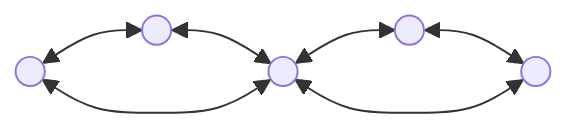
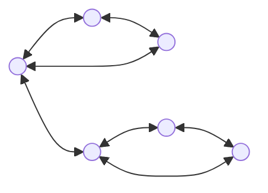

[카테고리](/README.md)
## 선인장 ([BCC](/그래프%20이론/그래프/BCC.md) 코드 필요)
```cpp
pair<bool, bool> isCactus(int n, const vector<vector<pair<int, int> > > &bccs) {
    vector<int> cnt(n + 1);

    for (auto &bcc : bccs) {
        auto nodes = getNodeOfBCC(n, bcc);

        int numEdges = bcc.size(), numNodes = nodes.size();
        if (numNodes > numEdges) continue; // 사이클을 이루는 bcc가 아님

        if (numNodes <= numEdges - 1) return {false, false}; // chord 존재, 간선선인장 아님
        for (auto node : nodes) ++cnt[node];
    }
    
    bool isEdgeCactus = true, isVertexCactus = true;
    for (auto e : cnt) if (e >= 2) isVertexCactus = false;
    return {isEdgeCactus, isVertexCactus};
}
```

### 시간복잡도
$O(V + E)$   

### 문제
[Cactus? Not cactus?](https://www.acmicpc.net/problem/10891) - 정점선인장 판별   
[선인장](https://www.acmicpc.net/problem/2111) - 간선선인장 판별   

### 용어정리
__간선선인장(Edge Cactus):__
그래프의 어떤 두 단순 사이클도 __`간선`__ 을 공유하지 않는 그래프(=각 __`간선`__ 이 최대 하나의 사이클에 포함되는 그래프)   

__정점 선인장(Vertex Cactus)__
그래프의 어떤 두 단순 사이클도 __`정점`__ 을 공유하지 않는 그래프(=각 __`정점`__ 이 최대 하나의 사이클에 포함되는 그래프)   


### 원리
정점선인장의 제약 조건이 간선선인장보다 더 강하다. 정점선인장은 모두 간선선인장이다.   
그래프에 chord가 존재하지 않으면 간선선인장이고(역도 성립),   
chord가 존재하지 않으며 2개 이상의 '싸이클을 이루는 BCC(포함된 정점 개수가 3개 이상인 BCC)'에 속한 정점이 없어야 정점선인장이다.   
chord의 존재 여부는 싸이클을 이루는 BCC에서 정점의 개수보다 간선의 개수가 많은지 확인하면 알 수 있다.   

BCC에서 정점의 개수를 $V$, 간선의 개수를 $E$라고 할 때   
$E \ge V$라면 해당 BCC는 사이클을 이룬다.    
$E = V$라면 해당 BCC는 단순사이클을 이루고,   
$E \ge V + 1$이라면 해당 BCC의 모든 정점을 지나는 사이클에 chord가 존재한다.   

### 참고링크
https://codeforces.com/problemset/problem/720/B - edge cactus
https://codeforces.com/problemset/problem/231/E - vertex cactus
https://ps.mjstudio.net/bcc   