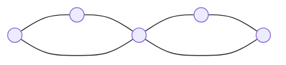
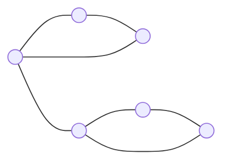

[카테고리](/README.md)
## 선인장
```cpp
pair <bool, bool> isCactus(int n, const vector<vector<pair<int, int> > > &bccs) {
    int trueValue = 1;
    vector<int> visited(n + 1);
    vector<int> cnt(n + 1);

    for (auto &bcc : bccs) {
        int numEdges = bcc.size(), numNodes = 0;
        ++trueValue;
        for (auto [u, v] : bcc) {
            numNodes += visited[u] != trueValue;
            numNodes += visited[v] != trueValue;
            visited[u] = visited[v] = trueValue;
        }

        if (numNodes > numEdges) continue; // 사이클을 이루는 bcc가 아님
        if (numNodes <= numEdges - 1) return {false, false}; // chord 존재, 간선선인장 아님
        for (auto [u, v] : bcc) ++cnt[u], ++cnt[v]; // 2번씩 세어짐 // ex) 사이클이 (1, 2), (2, 3), (3, 1)이면 1, 2, 3 각각 두 번 세짐
    }
    
    bool isEdgeCactus = true, isVertexCactus = true;
    for (auto e : cnt) if (e >= 4) isVertexCactus = false; // 2번씩 중복으로 세진거라 e=2k꼴임, e/2 >= 2 확인하면 됨
    return {isEdgeCactus, isVertexCactus};
}
```

### 시간복잡도
$O(V + E)$   

### 문제
[Cactus? Not cactus?](https://www.acmicpc.net/problem/10891) - 정점선인장 판별   

### 용어정리
__간선선인장(Edge Cactus):__
그래프의 어떤 두 단순 사이클도 __`간선`__ 을 공유하지 않는 그래프(=각 __`간선`__ 이 최대 하나의 사이클에 포함되는 그래프)   

(아래 예시 그림은 무향그래프임, 플랫폼에 따라서 유향그래프로 렌더링 될 수 있는데 간선방향 무시하고 보면 됨)   

__정점 선인장(Vertex Cactus)__
그래프의 어떤 두 단순 사이클도 __`정점`__ 을 공유하지 않는 그래프(=각 __`정점`__ 이 최대 하나의 사이클에 포함되는 그래프)   

(아래 예시 그림은 무향그래프임, 플랫폼에 따라서 유향그래프로 렌더링 될 수 있는데 간선방향 무시하고 보면 됨)   


### 원리
정점선인장의 제약 조건이 간선선인장보다 더 강하다. 정점선인장은 모두 간선선인장이다.   
그래프에 chord가 존재하지 않으면 간선선인장이고(역도 성립),   
chord가 존재하지 않으며 2개 이상의 '싸이클을 이루는 BCC(포함된 정점 개수가 3개 이상인 BCC)'에 속한 정점이 없어야 정점선인장이다.   
chord의 존재 여부는 싸이클을 이루는 BCC에서 정점의 개수보다 간선의 개수가 많은지 확인하면 알 수 있다.   

### 참고링크
https://codeforces.com/problemset/problem/720/B - edge cactus
https://codeforces.com/problemset/problem/231/E - vertex cactus
https://ps.mjstudio.net/bcc   