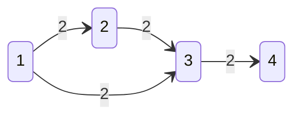

[카테고리](/README.md)
## 최대유량
### Edmonds–Karp (2D vector)
```cpp
template <typename F>
class Graph {
private:
    int n;
    vector<vector<int> > adj;
    F INF;
    vector<vector<F> > cap, flow;
    vector<int> parent;

    bool bfs(int s, int e) { // find augmenting path
        fill(parent.begin(), parent.end(), -1);

        queue<int> q;
        q.push(s);
        
        while (!q.empty()) {
            int cur = q.front();
            q.pop();

            for (auto &next : adj[cur]) if (!~parent[next] && cap[cur][next] > flow[cur][next]) {
                q.push(next);
                parent[next] = cur;
                if (next == e) return true;
            }
        }

        return false;
    };

public:
    Graph(int n) : n(n), adj(n + 1), INF(numeric_limits<F>::max()), cap(n + 1, vector<F>(n + 1, 0)), flow(n + 1, vector<F>(n + 1, 0)), parent(n + 1) {}

    void addEdge(int a, int b, F capacity=1) { // 1-based
        adj[a].push_back(b);
        adj[b].push_back(a); // residual graph

        if (!~capacity || cap[a][b] == INF) cap[a][b] = INF;
        else cap[a][b] += capacity;
        // cap[b][a] = cap[a][b]; // 양방향 간선, 정점분할했다면 VertexSplitedGraph::addEdge()부분 주석만 바꾸고 여긴 건들면 안됨
    }

    int maxFlow(int s, int e) { // 1-based
        int res = 0;

        while (bfs(s, e)) {
            F f = INF;
            for (int cur = e; cur != s; cur = parent[cur]) {
                int prev = parent[cur];
                f = min(f, cap[prev][cur] - flow[prev][cur]);
            }

            for (int cur = e; cur != s; cur = parent[cur]) {
                int prev = parent[cur];
                flow[prev][cur] += f;
                flow[cur][prev] -= f;
            }
            res += f;
        }

        return (res != INF ? res : -1);
    }
};
```
### Edmonds–Karp (map)
```cpp
template <typename F>
class Graph {
private:
    int n;
    vector<vector<int> > adj;
    F INF;
    map<pair<int, int>, F> cap, flow;
    vector<int> parent;

    bool bfs(int s, int e) { // find augmenting path
        fill(parent.begin(), parent.end(), -1);

        queue<int> q;
        q.push(s);
        
        while (!q.empty()) {
            int cur = q.front();
            q.pop();

            for (auto &next : adj[cur]) if (!~parent[next] && cap[{cur, next}] > flow[{cur, next}]) {
                q.push(next);
                parent[next] = cur;
                if (next == e) return true;
            }
        }

        return false;
    };

public:
    Graph(int n) : n(n), adj(n + 1), INF(numeric_limits<F>::max()), parent(n + 1) {}

    void addEdge(int a, int b, F capacity=1) { // 1-based
        adj[a].push_back(b);
        adj[b].push_back(a); // residual graph
        
        if (!~capacity || cap[{a, b}] == INF) cap[{a, b}] = INF;
        else cap[{a, b}] += capacity;
        // cap[{b, a}] = cap[{a, b}]; // 양방향 간선, 정점분할했다면 VertexSplitedGraph::addEdge()부분 주석만 바꾸고 여긴 건들면 안됨
    }

    F maxFlow(int s, int e) { // 1-based
        int res = 0;

        while (bfs(s, e)) {
            F f = INF;
            for (int cur = e; cur != s; cur = parent[cur]) {
                int prev = parent[cur];
                f = min(f, cap[{prev, cur}] - flow[{prev, cur}]);
            }

            for (int cur = e; cur != s; cur = parent[cur]) {
                int prev = parent[cur];
                flow[{prev, cur}] += f;
                flow[{cur, prev}] -= f;
            }
            res += f;
        }

        return (res != INF ? res : -1);
    }
};
```
### 정점분할
```cpp
template <typename F>
class VertexSplitedGraph {
private:
    Graph<F> graph;
    
    int in(int a) { return 2 * a - 1; } // 1-based
    int out(int a) { return 2 * a; } // 1-based

public:
    VertexSplitedGraph(int n) : graph(2 * n) {
        for (int i = 1; i <= n; i++) graph.addEdge(in(i), out(i), 1);
    }

    void addEdge(int a, int b, F capacity=1) { // 1-based
        graph.addEdge(out(a), in(b), capacity);
        // graph.addEdge(out(b), in(a), capacity); // 양방향 간선
    }

    F maxFlow(int s, int e) { // 1-based
        graph.addEdge(in(s), out(s), -1);
        graph.addEdge(in(e), out(e), -1);
        return graph.maxFlow(in(s), out(e));
    }
};
```
### 시간복잡도 
$O(VE^2)$   
밀집그래프에선 [디닉](/그래프%20이론/네트워크%20플로우/Dinic.md) 사용   

### Space-Time tradeoff
cap, flow 선언할 때 n^2배열 메모리초과 나는 경우 map 사용

* [도시 왕복하기 2](https://www.acmicpc.net/problem/2316) 채점결과   
    * map : (6264KB, 272ms)   
    * 2D vector : (7444KB, 16ms)   

### 사용설명
무한간선 추가하려면 addEdge(a, b, c)에서 c=-1 사용   
maxFlow()의 리턴값이 -1이라면 최대유량이 무한한 경우   

양방향 간선일 경우 public addEdge()에서 주석 해제   
주의할 점이 있는데, 정점 분할을 사용했다면 VertexSplitedGraph::addEdge()에서만 주석 해제
정점 분할 사용했는데 Graph::addEdge()에 있는 주석까지 해제하면 간선 엉켜서 계산 이상하게 됨

혹시나 무한간선이 여러개라면 INF끼리 더해지면서 오버플로우될 수 있음   
가상의 s'을 만들어서 s' -> s로 용량 INF의 간선을 만들고 s'->e의 최대유량을 계산하면 오버플로우 방지 가능   
정점분할에선 in(sink) -> out(sink)로 INF크기의 간선을 만들기 때문에 신경 안써도 됨   

최대유량에 직접적으로 영향을 주는, 즉 간선의 용량을 줄일 경우 최대유량도 줄어들게 되는 간선을 찾으려면 maxFlow()를 먼저 호출한 뒤 각 간선의 양 끝점 u, v에 대해 bfs(u, v)를 확인   
if (!bfs(u, v))라면 u에서 v의 모든 용량이 최대유량에 필수적으로 사용되고 있는 경우이므로 최대유량에 직접적으로 영향을 미치고 있는 간선   
단순히 cap[u][v] == flow[u][v]로 간선이 포화되어있는지만 확인하는 것으론 부족한데, 예를 들어 아래 그래프에서 maxFlow(1, 4)를 호출하였고 1->3으로 유량 2를 흘려주고 있는 상황이라면 cap[1][3] == flow[1][3]으로 포화되어있지만 1->3의 간선의 용량을 줄인다 하더라도 1->2->3을 거쳐서 줄인 용량만큼 흘려보내줄 수 있으므로 최대유량은 감소하지 않음   


### 백준문제
[도시 왕복하기 1](https://www.acmicpc.net/problem/17412)    
[간선 끊어가기 2](https://www.acmicpc.net/problem/14286) - 양방향 간선   
[도시 왕복하기 2](https://www.acmicpc.net/problem/2316) - 양방향 간선, 정점분할   
[학교 가지마!](https://www.acmicpc.net/problem/1420) - 양방향 간선, 정점분할, 무한간선   
[완전 중요한 간선](https://www.acmicpc.net/problem/5651) - 최대유량에 직접적으로 영향을 주는 간선   

### 참고문헌
https://en.wikipedia.org/wiki/Edmonds%E2%80%93Karp_algorithm